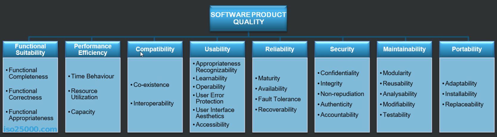

# Introduction

&nbsp;&nbsp;&nbsp;&nbsp; I have been thinking of an idea for some time now - to create a small web game solely for educational purposes. However, game design can be a challenging task, and at the moment my priorities lie more on a technical side of things, so I decided to create a clone of an existing game, maybe just a little bit modified to make things more interesting. I have chosen The Witcher 3 Gwent minigame to experiment upon, since I know the rules more or less and it is quite popular, so are there information about it on the internet easy to search for.
	
&nbsp;&nbsp;&nbsp;&nbsp; My main focus will be directed towards creating a backend or API first, with frontend development being probably a separate project. For educational purposes, I plan to create a bit overengineered version of the game and the knowledge gathered will serve me as a foundation for future projects.
	
&nbsp;&nbsp;&nbsp;&nbsp; I want to put more emphasis on quality attributes, so I am going to actively develop a well organized technical specification document. Besides it I am also writing this article in a form of blog post, so I can present my thought process in a natural language.

## Initial Design

&nbsp;&nbsp;&nbsp;&nbsp; First I will focus on describing what is really in my mind. I'll be more or less basing on the following materials which gives some directions on how to document / design a software:
- [arc42](https://arc42.org/overview) - what and how to document a software architecture
- [ISO Standard 25010](https://iso25000.com/index.php/en/iso-25000-standards/iso-25010) - quality attributes standards
- [Software Engineering TutorialsPoint](https://www.tutorialspoint.com/software_engineering/index.htm) - software engineering concepts
- [C4 Model](https://c4model.com/) - for visualising software architecture
 
&nbsp;&nbsp;&nbsp;&nbsp; As for the chronology of actions, along with the design progress I am also going to do some experimental coding/pseudocoding and try to map gathered domain or infrastructure knowledge onto the code in order to understand more how it should work, in a naive approach first as a separate mini project or maybe straight into the target one. It applies for the logic layer of the game as well as for infrastructure - obviously I should learn how various technologies works to make a use of it. 

&nbsp;&nbsp;&nbsp;&nbsp; Eventually, the architecture will be dictated by many factors though, not just game rules. In software architecture there exists is a concept of architectural drivers, the four groups are:
- Functional requirements
- Quality attributes
- Business constraints
- Technical constraints

The architecture will derive from all of these. I will describe everything later.

### Naming / Ubiquitous Language / Theme

&nbsp;&nbsp;&nbsp;&nbsp; The Gwent allows for using one of the few decks of cards used at a single game. There are at least 5 of them:
- Northern Kingdoms
- Nilfgaard Empire
- Scoia'tael
- Monsters
- Skellige

&nbsp;&nbsp;&nbsp;&nbsp; Since I want to change things just a little bit, I am going to change a game theme and rename decks and cards. I want it to take place in a postapo / scifi / nature environment, so the decks will named as following, with very brief description, there is no need for much storytelling really, right now at least:
- Settlers - rather casual people, hard working, create new towns, try to create a normal civilization in this dangerous world
- Technocrats - possess advanced technological knowledge, but without it are defenceless, not many of them left
- Ancestrals - lived here since always in the jungles, know how to survive in such extreme conditions
- Dinosaurs - dangerous monsters
- Nomads - live in small camps, moving all the time, hiding and plundering when an occasion appears

&nbsp;&nbsp;&nbsp;&nbsp; However, since I don't plan for creating a frontend yet, I'm not certain I'm going to use this naming at all for now. The best way would be to keep it "lore agnostic" and provide let's say cards and other's names and description from "outside" of the app or maybe in a frontend layer only, so it should not be hardcoded in backend. I need to be careful then with naming things, so it is still understandable to read and relate to original Gwent game and know for instance which card does what.

&nbsp;&nbsp;&nbsp;&nbsp; There is a TV series done by Steven Spielberg called "Terranova" It was about a group of people moving back in time to Mesozoic era and trying to make a living there.
Although the show didn't gain much popularity, I enjoyed it enough to use its name as title for this project.

### Feasibility Reasearch

#### Scope and Team
&nbsp;&nbsp;&nbsp;&nbsp; The game is not as big and there a lot of information in the web. The main challenge is infrastructure and presentation though.

#### Market
&nbsp;&nbsp;&nbsp;&nbsp; Due to the popularity of the game, there is no doubt there are examples of clone implementation or similar card games, but the reason is mainly for educational purposes, so doesn't matter. And.. it is gonna be a different setting / theme, to allow just for a little bit of creativity and making it different.

#### Alternative solutions
- Making another game - a game with more complex problems to solve would be interesting, not just a tic-tac-toe, but my goal is to focus on quality and technology, so better to have some smaller domain to build upon
- Making a business app - but my goal is to make a game, though probably a typical app and focusing on solving a realistic problem, could have more value, maybe for other people, maybe for, for a portfolio in more typical business industries other than gamedev.

#### Technical Feasibility
&nbsp;&nbsp;&nbsp;&nbsp; Although I don't have as much experience in backend development yet, I've done [something](https://github.com/drlsn/PageTree) already, so I'm pretty certain I can accomplish the task. Everything depends 
on how much I am going to focus on quality attributes.

#### Other technical options
- Unity3D with a networking plugin, ex. Photon
- .NET monolith with no event architecture and Blazor Server - no need for api, would work

#### Proposed Solution
- .NET microservices, React, HTML, CSS
- Message Bus, Event driven Architecture, Vertical Slices, REST or RPC WebApi, NGinX, Docker / Docker Swarm,
- Testing - unit, integration, E2E, performance

### Initial Features

&nbsp;&nbsp;&nbsp;&nbsp; A project technically has to have defined a start and end, so I need to be pretty specific about I which features and qualities exactly I want to include. After getting familiar with the rules, reading the game wiki or watching some gameplays and seeing the UI I've across with of the initial ideas. These are going to be revised later in the design stage.
Also, I am going to add a "Statistics" feature, so the players can view each other progress, well.. of course I don't really foresee anyone there, but instead I might actually create some bots for testing purposes in the future, but this is going to be as a scope of another project to minimize efforts, first things first.

#### Core Gameplay

| Actions 	| Views 	| 
| -------------	| -------------	| 
| Play Card  	| Card Board	|
| Pass Round    |  		|

#### Supporting
| Actions 	| Views 	| 
| -------------	| -------------	| 
| Join Game  	| Main Menu	|
| Quit Game   	|  		|

#### Statistics
| Views 	|
| -------------	|
| Statistics	|

#### Out of Scope

&nbsp;&nbsp;&nbsp;&nbsp; ???

### Initial Qualities

&nbsp;&nbsp;&nbsp;&nbsp; This is going a huge part of this project. On the other hand I could just start coding right now, without planning, off the top of my head and it would probably give some effects, but I wouldn't have much control on the quality of the project. Maybe if the time was a problem, then sure, there is always a trade off, better quality = more time spent. But, what do I even mean by quality though? I'll try to explore this topic a bit in this section, but I'll leave details for later.  

&nbsp;&nbsp;&nbsp;&nbsp; First of all, as the biggest influence I'll use [ISO Standard 25010](https://iso25000.com/index.php/en/iso-25000-standards/iso-25010). I am going to use it in a rather pragmatic way and modify it for own needs.

&nbsp;&nbsp;&nbsp;&nbsp; There is many things to explain here. I am obviously not going to cover every single item from the list. I'll choose some of them and try to organize it in a more understandable for me way and based information available through the web. Actually, definitions I'm going to give it might be simpler and more pragmatic. The key is to learn how to effectivelly measure the quality of a software and other resources in an automated way.

&nbsp;&nbsp;&nbsp;&nbsp; It is important to take multiple parts into consideration:
- code,
- networks
- static assets (graphics, fonts, texts etc.)
- dynamic data

&nbsp;&nbsp;&nbsp;&nbsp; Architecture derives from architectural drivers and quality attributes can apply to software on multiple levels of:
- System Level - as a whole, could be multiple distributed services along with external ones - could be 
- Container Level - a single process app - backend, service, frotend app, mobile app, api gateway, database, message queue
- Component Level - separate components or layers in a single container
- Code Level - single methods or lines of codes

Examples:
| Attribute SubItem| System Level| Container Level| Component Level | Code Level| Measure Examples|  
| ---| ---| ---| ---| ---| --- |  
| Request speed | Request trace, time span through multiple services| Request time span in single service|| Performance of a single method|Requests per seconds|  
| Test| E2E, API, Integration tests created per endpoint or feature | API Tests, app layer tests | Unit tests ?? | Unit tests | Test coverage, Tests passing |

&nbsp;&nbsp;&nbsp;&nbsp; Based on these, later I will also provide:
- which attribute should be applied to which items,
- what and how the attributes will impact other attributes,
- what are the chosen attributes per modules, their priorities and order of developing

&nbsp;&nbsp;&nbsp;&nbsp; Now I will provide brief descriptions of attributes I am likely to choose, with initally proposed metrics and technical solutions:

#### Functionality

#### Maintainability

#### Security

#### Performance

### Deliverables

- Backend API
- Documentation
- Production and Staging application hosted

### Constraints

### Budget

&nbsp;&nbsp;&nbsp;&nbsp; The costs might appear for hosting, so it is important to minimize it.

### Team

&nbsp;&nbsp;&nbsp;&nbsp; Single member - backend design and development.

### Time

&nbsp;&nbsp;&nbsp;&nbsp; 01.06.23 - 01.08-23 - The time required must include learning, design and development. 

## Business and Technical Decisions

&nbsp;&nbsp;&nbsp;&nbsp; Since I want to create this project mainly to learn certain concepts and technologies I am going to combine business and technical decisions together. Initial idea of concepts and technologies basics learned and applied in a project could or could not include following - yet to explore and to be decided:

| Concepts 					| Technologies Chosen			| Why			  		| Alernatives (realistic) 		|
| ---						| --- 					| 					|					|
| Programming Language / Environment 		| c# 10/11, .NET 7			|					|					|
| Development Environment 			| Windows, Docker, Visual Studio	|					|					|
| Production Environment  			| AWS / Linux / Docker			|					|					|
| Version Control / Code Hosting		| Git / Github				|					|					|
| CI / CD / Production Deployment  		| Github Actions / Azure Devops	/ AWS ??|					|					|
| Network Communication Protocols  		| HTTP / HTTPS				|					|					|
| Load balancing / Reversed Proxy  		| NGinx					|					|					|
| Microservices as containers   		| Docker / Docker Swarm	 		|					|					|
| Database / ORM / Query Language   		| MSSQL / EF Core 6+ / SQL / T-SQL 	|					|					|
| Message / Events Communication   		| RabbitMQ 				|					|					|
| CQRS						| Mediator, Automapper			|					|					|
| Unit Testing  				| NUnit / xUnit / Moq / NSubstitute 	|					|					|
| Integration Testing				| NUnit / xUnit / Moq / NSubstitute  	|					|					|
| API Testing  					| Postman  				|					|					|
| E2E Testing  					| ???  					|					|					|
| Performance Testing  				| ???  					|					|					|
| Data Caching  				| Redis / Nginx ???			|					|					|

#### Addictional concepts:
- Vertical Slice Architecture
- REST API / RPC API

## System Context

diagram and description!

